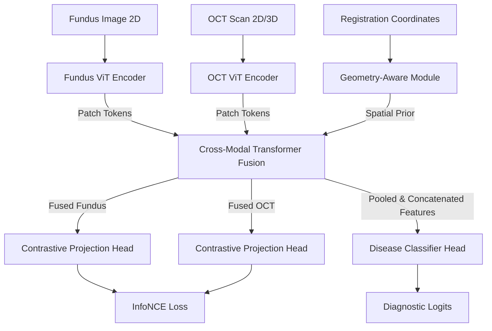

# Geometry-Aware Cross-Modal Vision Transformer (GeoCrossViT) for Retinal Disease Detection

GeoCrossViT is a research-grade, production-ready PyTorch repository designed for the multi-modal diagnosis of retinal diseases (e.g., Diabetic Retinopathy, Glaucoma, and Macular Degeneration) by fusing Color Fundus Photography (CFP) and Optical Coherence Tomography (OCT) images. 

By leveraging Vision Transformers (ViTs) and geometry-aware relative coordinate mapping, the model aligns 2D surface features with 3D structural volumes, optimizing feature representations via a joint self-supervised InfoNCE pretraining strategy and downstream classification task heads.

---

## Architecture Overview

GeoCrossViT employs a dual-branch ViT encoder architecture linked by a bidirectional cross-modal transformer fusion block that respects geometric alignment metadata.



1. **Vision Transformer (ViT) Encoders**: Separate patch projection layers encode distinct modalities independently, yielding local feature tokens.
2. **Geometry-Aware Module**: Maps spatial coordinate offsets/alignment matrices into the transformer embedding space to provide geographic registration priors between the fundus retina surface and cross-sectional OCT scans.
3. **Cross-Modal Transformer Fusion**: Executes alternating cross-attention updates between Fundus and OCT tokens, regularized by the spatial priors.
4. **Self-Supervised Contrastive Head**: Projects cross-modal outputs into a low-dimensional space to compute the InfoNCE loss for alignment pretraining.
5. **Disease Classifier Head**: Pools and concatenates fused multimodal tokens to predict downstream clinical diagnostic probabilities.

---

## Directory Structure

```directory
GeoCrossViT/
├── configs/
│   └── config.py                 # Dataclasses defining model, dataset, and training hyperparams.
├── datasets/
│   ├── dataset.py                # PyTorch Dataset handling paired multi-modal loading.
│   ├── transforms.py             # Custom geometry-preserving augmentations.
│   └── datamodule.py             # Wrappers for Train/Val/Test DataLoaders.
├── models/
│   ├── vit_encoder.py            # Modality-specific Vision Transformer.
│   ├── geometry_module.py        # Relative coordinates mapping network.
│   ├── cross_modal_transformer.py# Bidirectional cross-modal fusion block.
│   ├── projection_head.py        # Contrastive projection MLP.
│   ├── classifier.py             # Downstream diagnostic classification layer.
│   └── attention_visualizer.py   # Extraction and overlay generator for attention maps.
├── losses/
│   └── info_nce.py               # Contrastive InfoNCE loss function.
├── trainers/
│   ├── trainer.py                # Optimization loop executor.
│   └── validate.py               # Evaluation loops run during training.
├── evaluation/
│   ├── evaluate.py               # Final checkpoint verification script.
│   ├── visualize.py              # ROC/PR curves and confusion matrix plotting.
│   └── metrics.py                # AUC, sensitivity, and specificity calculations.
├── deployment/
│   └── app.py                    # Gradio web application prototype.
├── utils/
│   ├── logger.py                 # Structured logging setups.
│   ├── seed.py                   # Deterministic execution seedings.
│   └── checkpoint.py             # Save and restore utilities for states.
├── foundation_model.py           # Integration wrapper for encoders, modules, and heads.
├── train.py                      # Main training entrypoint.
├── inference.py                  # Main single-sample or batch inference runner.
├── requirements.txt              # Production package requirements.
└── README.md                     # Documentation.
```

---

## Installation

Ensure you have Python 3.10+ installed.

1. **Clone the Repository**:
   ```bash
   git clone https://github.com/your-username/GeoCrossViT.git
   cd GeoCrossViT
   ```

2. **Install Dependencies**:
   ```bash
   pip install -r requirements.txt
   ```

---

## Training and Fine-Tuning

Training can be run in two modes: `pretrain` (self-supervised contrastive learning) or `classify` (supervised diagnostic training).

To execute supervised training:
```bash
python train.py --mode classify --config configs/config.py
```

To run self-supervised contrastive pretraining:
```bash
python train.py --mode pretrain --config configs/config.py
```

*Configurable hyperparameters such as learning rate, batch size, and network dimensions can be customized directly in [configs/config.py](file:///C:/Users/krohi/.gemini/antigravity/scratch/GeoCrossViT/configs/config.py).*

---

## Evaluation

Calculate full test statistics and generate plots using:
```python
from configs.config import GeoCrossViTConfig
from foundation_model import GeoCrossViT
from datasets.datamodule import RetinalDataModule
from evaluation.evaluate import run_evaluation

# Load config and datamodule
config = GeoCrossViTConfig()
dm = RetinalDataModule(config)
dm.setup("test")

# Build model and run evaluation
model = GeoCrossViT(config.model)
metrics = run_evaluation(
    config=config,
    model=model,
    test_loader=dm.test_dataloader(),
    checkpoint_path="checkpoints/best_model.pth"
)
print("Test Metrics:", metrics)
```

---

## Deployment Demo

The local Gradio-based diagnosis app serves as an interactive clinical demo where practitioners can drag-and-drop Fundus/OCT scan pairs, execute diagnostics, and view multi-modal attention overlays.

To launch the Gradio demo:
```bash
python deployment/app.py
```
After executing, navigate to `http://127.0.0.1:7860` in your web browser.

---

## Future Work

1. **Geometry Loss Integration**: Introduce relative loss functions regularizing distance maps of cross-attention weights.
2. **Dense Cross-Modal Alignment**: Add patch-to-patch contrastive loss constraints rather than global token alignment.
3. **Clinical Interpretation**: Deploy Attention Rollout to render pixel-level structural overlays on retinal scans.
4. **Scalability**: Support distributed pretraining (DDP) for large scale retinal datasets.
